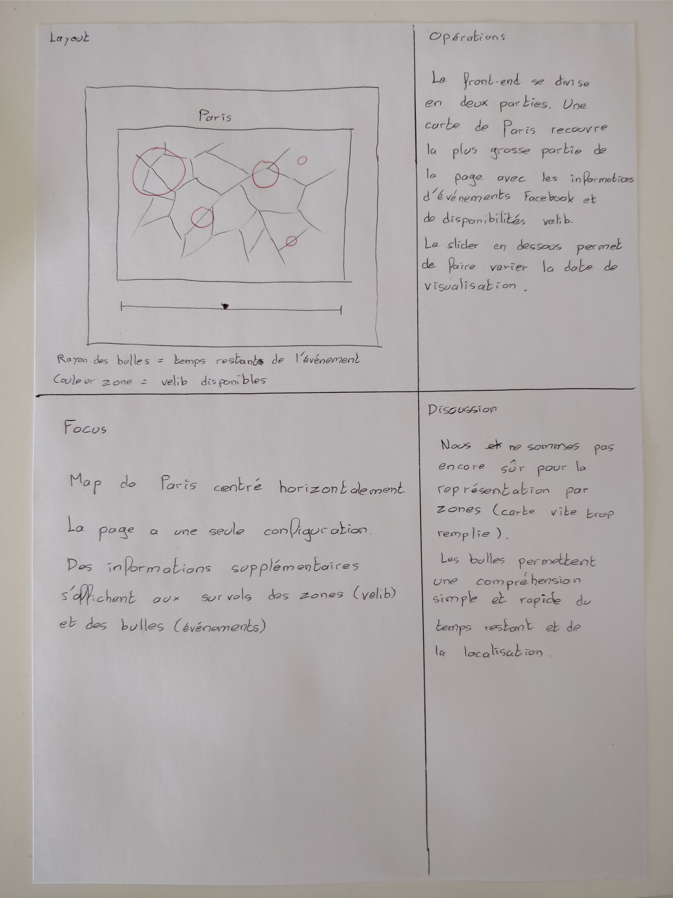

# Proposition de design

## Illustration

## Explications

Voici notre proposition de design : 

La page d'accueil du site se constituera d'une carte de la ville de Lyon (changement de ville par manque de données sur la ville de Paris). Celle-ci sera accompagnée d'un slider permettant de visualiser l'altitude.

Sur cette carte figureront plusieurs informations :
- Les différentes stations Velo'v (dans les différents arrondissements et quartiers)
- Le nombre de Velo'V disponibles à une certaine date
- Les événements Facebook situés à Lyon à la même date

En dessous de la carte figurera un slider horizontal permettant de faire varier la date et ainsi de voir une possible corrélation entre les débuts et fins d'événements et le nombre de vélos disponibles en station.
